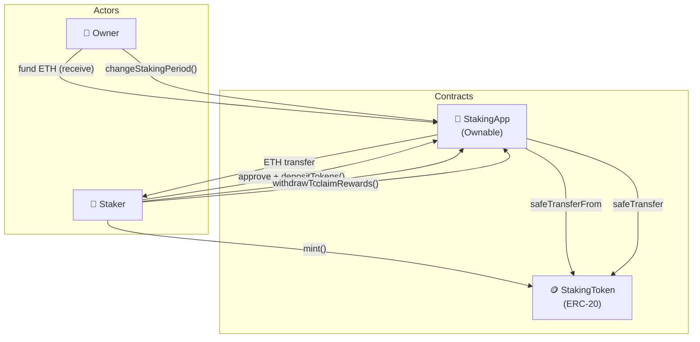

# 🏦 StakingApp

[](https://github.com/noelialuz/StakingApp)
[](https://soliditylang.org/)
[](https://getfoundry.sh/)
[](https://opensource.org/licenses/MIT)

> **A Foundry-based ERC-20 staking dApp where users lock a fixed token amount and claim ETH rewards after a configurable period.**

StakingApp is a learning-oriented smart contract project that demonstrates token staking with time-locked ETH rewards. Users deposit a predefined ERC-20 amount, wait for the staking period to elapse, and claim ETH funded by the contract owner. The owner can fund the contract, adjust the staking period, and manage access through OpenZeppelin's `Ownable`.

**Key features:**

- 🔒 Fixed-amount ERC-20 deposits — one active stake per user
- ⏱️ Configurable staking period with multi-period reward accrual
- 💰 ETH reward claims after the lock period
- 👤 Owner-controlled funding via `receive()` and period updates
- 🛡️ `SafeERC20` transfers and Checks-Effects-Interactions (CEI) on withdrawals
- ✅ Full unit test suite (15 tests) covering deposit, withdraw, rewards, and access control

---

## 📋 Table of Contents

1. [Prerequisites & Dependencies](#-prerequisites--dependencies)
2. [Technologies & Versions](#-technologies--versions)
3. [Project Structure](#-project-structure)
4. [Quick Start](#-quick-start)
5. [Running Tests](#-running-tests)
6. [Cache & Architecture](#-cache--architecture)
7. [Security Policy](#-security-policy)
8. [Scripts & Commands](#-scripts--commands)
9. [License](#-license)
10. [About the Author](#-about-the-author)

---

## 📦 Prerequisites & Dependencies

### System requirements

| Requirement | Notes |
| :-- | :-- |
| 🖥️ **OS** | macOS, Linux, or Windows (WSL recommended) |
| 🦀 **Foundry** | [Install Foundry](https://book.getfoundry.sh/getting-started/installation) — includes `forge`, `cast`, and `anvil` |
| 🔧 **Git** | Required for cloning and managing submodules |

Install Foundry:

```bash
curl -L https://foundry.paradigm.xyz | bash
foundryup
```

Verify the installation:

```bash
forge --version
```

### Project dependencies

Dependencies are managed as Git submodules under `lib/` and pinned in [`foundry.lock`](./foundry.lock).

| Dependency | Version | Purpose |
| :-- | :-- | :-- |
| [OpenZeppelin Contracts](https://github.com/OpenZeppelin/openzeppelin-contracts) | `v5.6.1` | `ERC20`, `Ownable`, `SafeERC20` |
| [forge-std](https://github.com/foundry-rs/forge-std) | `v1.16.1` | Foundry testing utilities and cheatcodes |

> [!WARNING]
> When installing OpenZeppelin via git, avoid tracking the `master` branch. Use tagged releases (for example `@v5.6.1`) so builds stay reproducible. See the [OpenZeppelin Foundry installation notes](https://github.com/OpenZeppelin/openzeppelin-contracts/blob/master/README.md#foundry-git).

Install or update dependencies explicitly:

```bash
forge install foundry-rs/forge-std@v1.16.1
forge install OpenZeppelin/openzeppelin-contracts@v5.6.1
```

---

## 🛠 Technologies & Versions

| Technology | Version | Role |
| :-- | :-- | :-- |
| **Solidity** | `0.8.35` | Smart contract language |
| **Foundry (forge)** | `1.7.1+` | Build, test, and deploy toolchain |
| **OpenZeppelin Contracts** | `v5.6.1` | Battle-tested contract libraries |
| **forge-std** | `v1.16.1` | Test helpers, cheatcodes, assertions |
| **Git submodules** | — | Dependency management via `lib/` |

---

## 📁 Project Structure

```bash
StakingApp/
├── 📂 src/
│   ├── StakingApp.sol        # Main staking logic: deposit, withdraw, claim rewards
│   ├── StakingAppv1.sol      # Draft / alternate implementation (WIP)
│   └── StakingToken.sol      # Mintable ERC-20 token used for staking
├── 📂 test/
│   ├── StakingAppTest.t.sol  # StakingApp unit tests (14 tests)
│   └── StakingTokenTest.t.sol # StakingToken unit tests (1 test)
├── 📂 lib/
│   ├── forge-std/            # Foundry standard library (submodule)
│   └── openzeppelin-contracts/ # OpenZeppelin contracts (submodule)
├── 📂 cache/                 # Foundry compilation cache (auto-generated)
├── 📂 out/                   # Compiled artifacts & ABIs (auto-generated)
├── foundry.toml              # Foundry project configuration
├── foundry.lock              # Pinned dependency versions
└── README.md
```

---

## 🚀 Quick Start

### 1. Clone the repository

```bash
git clone https://github.com/noelialuz/StakingApp.git
cd StakingApp
```

### 2. Install dependencies

```bash
forge install
```

If submodules are missing, run the explicit install commands from the [Prerequisites](#-prerequisites--dependencies) section.

### 3. Compile the contracts

```bash
forge build
```

A successful build produces artifacts in `out/` and updates the cache in `cache/`.

### 4. Run the test suite

```bash
forge test
```

### 5. Format the code (optional)

```bash
forge fmt
```

Check formatting without modifying files:

```bash
forge fmt --check
```

### Usage overview

Deploy `StakingToken` and `StakingApp`, then interact with the staking contract:

```solidity
// 1. Deploy StakingToken and StakingApp with constructor parameters.
// 2. Owner funds StakingApp with ETH (receive is restricted to owner).
// 3. User approves and deposits the fixed staking amount.
// 4. After stakingPeriod elapses, user calls claimRewards().
```

Example test flow with Foundry cheatcodes:

```solidity
stakingToken.mint(tokenAmount);
IERC20(stakingToken).approve(address(stakingApp), tokenAmount);
stakingApp.depositTokens(tokenAmount);

vm.warp(block.timestamp + stakingPeriod);
stakingApp.claimRewards();
```

---

## 🧪 Running Tests

### Run all tests

```bash
forge test
```

Expected output includes a summary table:

```text
╭------------------+--------+--------+---------╮
| Test Suite       | Passed | Failed | Skipped |
+==============================================+
| StakingAppTest   | 14     | 0      | 0       |
|------------------+--------+--------+---------|
| StakingTokenTest | 1      | 0      | 0       |
╰------------------+--------+--------+---------╯
```

### Verbose output

Show logs and traces for each test:

```bash
forge test -vvv
```

Maximum verbosity (stack traces on failure):

```bash
forge test -vvvv
```

### Run a specific test file

```bash
forge test --match-path test/StakingAppTest.t.sol
```

### Run a single test function

```bash
forge test --match-test testDepositTokensCorrectly
```

### Gas report

Generate a gas usage report for all tests:

```bash
forge test --gas-report
```

### Test coverage

```bash
forge coverage
```

### Test suites covered

| Suite | Tests | Scope |
| :-- | :-- | :-- |
| `StakingAppTest` | 14 | Deployment, deposits, withdrawals, rewards, owner access, ETH funding |
| `StakingTokenTest` | 1 | Token minting |

---

## 🗄 Architecture

StakingApp consists of two main contracts and three actor roles:



#### Contract responsibilities

| Contract | Responsibility |
| :-- | :-- |
| **`StakingToken`** | Simple mintable ERC-20 token used as the staking asset |
| **`StakingApp`** | Holds staked tokens, tracks user balances and lock timestamps, distributes ETH rewards |

#### Core state

| Variable | Description |
| :-- | :-- |
| `stakingToken` | Address of the ERC-20 token to stake |
| `stakingPeriod` | Minimum time (seconds) before rewards can be claimed |
| `fixedStakingAmount` | Exact token amount required per deposit |
| `rewardPerPeriod` | ETH reward paid per completed staking period |
| `userBalance` | Active stake amount per user |
| `elapsePeriod` | Timestamp when the user started or last claimed |

#### User flow

1. **Deposit** — User approves and calls `depositTokens(fixedStakingAmount)`. Only one active stake per address.
2. **Wait** — Staking period must elapse. Multiple periods accrue proportionally.
3. **Claim** — User calls `claimRewards()` to receive ETH. The elapsed timer advances by claimed periods.
4. **Withdraw** — User calls `withdrawTokens()` to recover staked ERC-20 tokens (CEI pattern applied).

#### Owner flow

1. **Fund** — Owner sends ETH to the contract via `receive()` (owner-only).
2. **Configure** — Owner calls `changeStakingPeriod()` to update the lock duration.

---

## 🔐 Security Policy

> ⚠️ **This project is intended for learning and demonstration purposes only.** It has **not** undergone a professional security audit.

### Known considerations

| Area | Detail |
| :-- | :-- |
| 🎓 **Educational scope** | Not production-ready; use at your own risk |
| 💸 **Owner trust** | Owner controls ETH funding and staking period — users must trust the owner |
| 🔁 **Reentrancy** | Withdrawals follow CEI; reward claims use low-level `call` — review before mainnet use |
| 🪙 **Token model** | `StakingToken.mint()` is unrestricted — suitable for testing only |
| 📦 **Dependencies** | Keep OpenZeppelin and forge-std on tagged releases aligned with `foundry.lock` |

### Before using in production

- [ ] Review staking, withdrawal, and reward logic in [`src/StakingApp.sol`](./src/StakingApp.sol)
- [ ] Run the full test suite: `forge test`
- [ ] Consider a professional audit
- [ ] Restrict token minting and add access controls as needed
- [ ] Keep dependencies pinned to tagged releases

### Reporting vulnerabilities

If you discover a security issue, please **do not** open a public GitHub issue. Contact the repository owner directly (see [About the Author](#-about-the-author)).

Smart contracts carry inherent technical and financial risk. Use this repository at your own responsibility.

---

## 📜 Scripts & Commands

This project does not include a `script/` deployment folder yet. All operations are performed through Foundry CLI commands:

| Command | Description |
| :-- | :-- |
| `forge build` | Compile all contracts |
| `forge test` | Run the full test suite |
| `forge test -vvv` | Run tests with detailed traces |
| `forge test --gas-report` | Show gas usage per function |
| `forge coverage` | Generate test coverage report |
| `forge fmt` | Format Solidity source files |
| `forge fmt --check` | Verify formatting (CI-friendly) |
| `forge clean` | Remove `cache/` and `out/` artifacts |
| `anvil` | Start a local Ethereum node for manual testing |
| `cast call <addr> <sig>` | Read on-chain state from a deployed contract |
| `cast send <addr> <sig>` | Send a transaction to a deployed contract |

### Adding deployment scripts

To add deployment automation, create a `script/` directory:

```bash
mkdir script
```

Then add a Foundry script (e.g. `script/Deploy.s.sol`) and run it with:

```bash
forge script script/Deploy.s.sol --rpc-url <RPC_URL> --broadcast
```

---

## 📄 License

StakingApp is released under the [MIT License](https://opensource.org/licenses/MIT).

SPDX identifiers in source files: `// SPDX-License-Identifier: MIT`

---

## 👤 About the Author


| | |
| :-- | :-- |
| **Name** | Noelia Luz Fernández|
| **GitHub** | [@Noelialuz](https://github.com/noelialuz) |
| **LinkedIn** | https://www.linkedin.com/in/noelia-luz-fernandez-03404440/|
| **Email** | noelia_luz_fernandez@hotmail.com |

---

## 📚 Learn More

- [Foundry Book](https://book.getfoundry.sh/) — compilation, testing, and cheatcodes
- [OpenZeppelin Contracts documentation](https://docs.openzeppelin.com/contracts) — ERC-20, access control, and `SafeERC20`
- [OpenZeppelin Contracts repository](https://github.com/OpenZeppelin/openzeppelin-contracts) — dependency source and release tags
